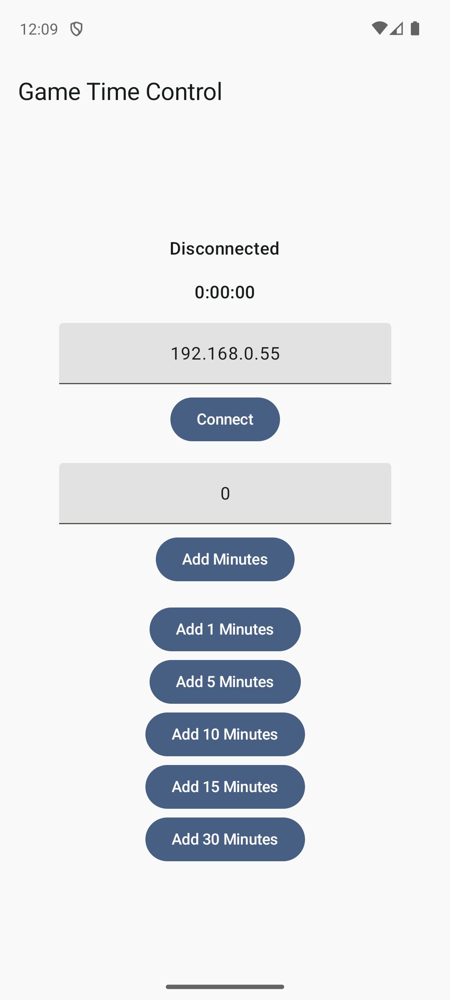

# Game Time Control

A simple tool to automatically shut down your PC after a specified time, remotely controlled from a mobile device. Also displays a notification when 10 minutes and 1 minute left. Useful for controlling children's screen time.

Currently supported platforms:

- PC (server): Windows
- Remote controller (client): Android

## Tech stack

- [Kotlin Multiplatform](https://kotlinlang.org/docs/multiplatform.html)
- [Compose Multiplatform](https://www.jetbrains.com/compose-multiplatform/)
- [Decompose](https://github.com/arkivanov/Decompose)
- [MVIKotlin](https://github.com/arkivanov/MVIKotlin)
- [Reaktive](https://github.com/badoo/Reaktive/)
- [Ktor](https://ktor.io/)
- [kotlinx-serialization](https://github.com/Kotlin/kotlinx.serialization)

## Screenshots

 

## Author

Twitter: [@arkann1985](https://twitter.com/arkann1985)

If you like this project you can always  ;-)
